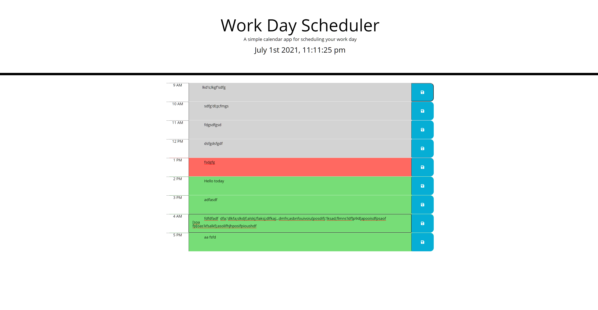
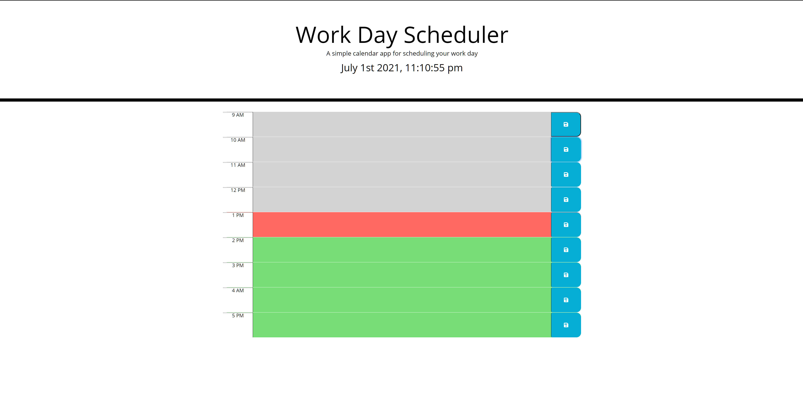

# Work-day-scheduler

I thought that this project was pretty good, I keep improving on each homework assignment. The more the weeks go on I feel like I get better. 
Overall I was able to get each part of the criteria right except the last part. I feel as though functions are my weak point and I should
take some time to review and go over it so I can get better and improve. It took me a while to get the time-blocks right but eventually I was able to get it. 

[Github](https://lewiscapers206.github.io/Work-day-scheduler/)